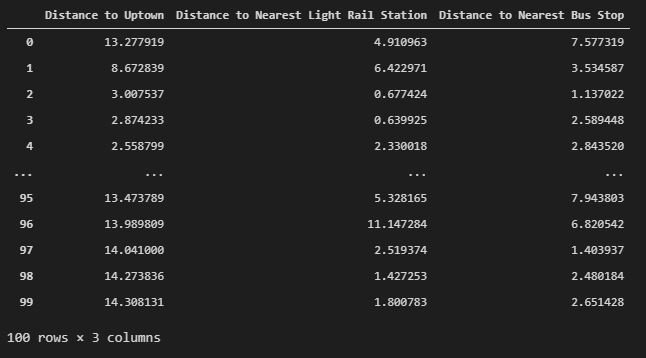

# Coursera_Capstone
Capstone project for IBM Data Science Professional Certificate course through Coursera

# Introduction

The city of Charlotte is home to a wide variety of growing businesses in recent years and has begun to focus attention towards attracting younger people to the city in hopes of creating a long-lasting workforce. However, like most major cities, young people looking to move there struggle with searching for a suitable place to live. If the city of Charlotte is able to understand its housing market better, then it will be able to take action to make the city more attractive to potential new young citizens. It is also possible that such a tool can be used externally, to help people understand what options are available for housing and what the benefits and drawbacks are of living in particular neighborhoods. There are many different types of housing accommodations, and many points of interest to consider when choosing a place to live. For the sake of simplicity and ease of access to data, this project will limit the scope of the problem to include only apartments, and primarily focus on the significant issue of transportation. The goal is to use the Foursquare API to find apartment complexes in the Charlotte area and determine how a target customer -- a person looking to move to the area for a job in the uptown area of the city -- would best commute to work from each location. In order to do this, the Foursquare API will be used to query for locations related to the two main types of public transportation in the Charlotte area: bus stops and light rail stations. Using this data, the main features that will be extracted from the data include the distance from each apartment to the uptown area of Charlotte, the distance from each apartment to the nearest light rail station, and the distance from each apartment to the nearest bus stop. From there, the k-Means clustering algorithm will be used to separate the apartments into groups based on the features. The benefit of this is that higher-ups in the city will be able to properly allocate infrastructure resources into noted areas of the city to accommodate anticipated growth. Externally, the clustering can provide insight to target customers about which areas are best to live in for their preferred transportation method. Further work, if possible, will contain acquiring more specific information about each apartment complex and what apartments are available, for example the square footage of each apartment, number of bathrooms and bedrooms, and price. From there it would be possible to more efficiently cluster the apartments

# Data
The data that is collected is the list of 100 closest apartment complexes within a 32km (~20 mile) radius of Charlotte, North Carolina. Other data that is gathered are the coordinates of bus stops and light rail stations within the same radius of the same coordinates used to denote Charlotte. There were 22 Bus stops and 31 light rail stations gathered. The Foursquare API allows this data to be gathered with ease by using category IDs for various venue types. For example, when querying the Foursquare API with only the search query "light rail station" among the top results are venues that are not relevant but match words in the query like "Modern Lighting Design Showroom" and "City Lights Rooftop Bar." But by using the unique category ID for light rail stations "4bf58dd8d48988d1fc931735" the Foursquare API is able to return only venues that match the category and unnecessary data is ignored.

For the purposes of this project, only the latitude and longitude values of the apartments, light rail stations, and bus stops are needed, as the conclusions that want to be drawn from the data relate solely to the proximity of apartments to public transportation.

The results of the queries to the Foursquare API led to some assumptions being made. Because the Foursquare API does not track information about apartment complexes that renters may find important and does not include information that would be relevant to city planning, every apartment returned by the API is treated with the same weight (i.e. expensive apartments are not given less weight with regard to public transportation in the scenario that people who can afford to live there can also afford cars). Another important note about the data is that within a 20 mile radius, only 22 bus stops were returned by the query. It is unlikely that there are only 21 bus stops in the Charlotte area in reality. In addition to this, with the target of focusing on young people looking for work in the uptown Charlotte area, it is unlikely that all bus stops near Charlotte are on routes that move towards uptown. As there is no free API easily available to gather data for comparison, all of the bus stops and light rail stations are given the same weight, as if they all provide equivalent transportation access. Given more data, it would be more feasible to properly analyze specific bus routes and ignore ones that are not relevant to a specific destination. But generally, this project is able to show a proof of concept regarding the access of the queried apartments to public transportation.

Previews of the data are shown below:

Apartment data:

Light rail data:

Bus stop data:

# Methodology

Because the Foursquare API allowed for apartments, light rail stations, and bus stops to be searched by category ID and all resulting data was completely filled in, no preprocessing of the data was performed.

Initial exploration of the data involved displaying the located venues on a map. This was done using the folium python library. An image of the map that was produces is shown below:

In this map, the blue markers represent apartment buildings, black markers represent light rail station, and purple markers represent bus stops. The larger yellow maker notes the center of uptown Charlotte. From this it is clear that the concentration of most apartments and public transportation services are near the uptown area in the center of the city, which is expected. The apartments farther away from the city are usually close to a light rail station or bus stop as well.

Because the three main features used for clustering are the distance to uptown, distance to the nearest light rail station, and distance to the nearest bus stop, the inferential statistical testing was composed of brief calculations into these numbers.
Once the required distances for each apartment was calculated, the mean of each feature was calculated. These values are shown in the table below.

| Feature        | Mean Value           |
| ------------- |:-------------:|
| Distance to Uptown      | 6.46km |
| Distance to Nearest Light Rail Station      | 2.25km      |
| Distance to Nearest Bus Stop | 2.46km      |

It was also calculated that across all apartments, there is a mean of 1.59 light rail stations within a 1km radius, and a mean of 0.51 bus stops within a 1km radius. One kilometer was chosen as a distance that most people would be reliably comfortable walking in order to get to a form of public transportation.

Once the distances to uptown, the nearest light rail station, and nearest bus stop were calculated for each apartment building, the data were prepared for clustering. This was done by isolating the distances into a pandas dataframe and normalizing them using the scikit-learn library's normalization function. This was done in order to combat issues with the scaling of values, noting that the distance to uptown was often far greater than the distance to nearby public transportation resources. 

A preview of the dataframe used for clustering before normalization is shown below:

A preview of the same dataframe after normalization is shown below:

Once all of the values were normalized to values between 0 and 1, they were ready for clustering.

There are many different clustering techniques available, but given the recent use of k-means in previous labs in the course, I chose to use k-means for clustering this data. While k-means is a strong unsupervised machine learning algorithm, it is good to tune parameters ahead of time to ensure that the model is running optimally. The most significant parameter to tune with this model is k, the number of clusters. I used the elbow method to deduce which number of clusters was best appropriate, and after observing the graph below, chose 3 as a suitable number of clusters.

# Results

After running the k-Means clustering with 3 clusters on the normalized data, the resulting labels are previewed in the far right of the below dataframe:

Assigning these clusters colors and coloring the markers previously shown on the map allows for visualization of the clusters:

In the above image, yellow, black, and purple are still used to represent the center of uptown Charlotte, light rail stations, and bus stops, respectively. The red, green, and blue represent the clusters that the apartments were placed into from the k-Means algorithm.

It is clear from observing the map that the green cluster is mainly composed of apartments near the center of the city, while the apartments on the outskirts of the city are farther away. Because they all seem to be similarly distant from uptown, the dividing factor between the red and blue clusters is the proximity to light rail stations and bus stops.

A breakdown of each cluster's average distance to uptown, the nearest light rail station, and the nearest bus stop are shown in the graph below:

And the number of apartments in each cluster are shown in the graph below:

From these graphs, it is clear that cluster 0, the green cluster, is very close to both uptown and both forms of public transportation. Meanwhile, clusters 1 and 2 are distant from uptown. As previously mentioned, cluster 2, the blue cluster, is closer on average to both light rail stations and bus stops compared to cluster 1, the red cluster. It is seen in the second graph that the green cluster has the most apartments in it, while the blue has the second-most and the red cluster has the fewest. It seems that there is an unsurprising trend that as you get closer to the city and closer to public transportation, there are more apartment buildings.

# Discussion

The results of the clustering showed three distinct groups of apartments: One group that was close to Charlotte and close to public transportation, one group that was far from Charlotte and far from public transportation, and one group that was far from Charlotte but close to public transportation. The implications of this are significant in multiple ways to both target groups. The City of Charlotte would be interested in these results for the sake of resource allocation and understanding of the housing market. For example, they may be interested in adding more room in the budget for expansion of public transportation to areas where apartments in the red cluster are located. If that were done and apartments in the red cluster became closer on average to light rail stations or bus stops, then it is likely that running the clustering algorithm on the new data would result in more similarities between the red and blue clusters, and would potentially result in enough similarities between the two to warrant use of two clusters instead of three. It would also be possible to focus on expanding further housing development to land that is already close to public transportation, or putting money and effort into infrastructure or other efforts to make those areas more attractive to housing developers or to people looking to move to the area.

To a person who is looking to move to Charlotte, this same clustering of apartments may be helpful for the purpose of deciding where to move. While this project does not go into data about apartments such as rent, square footage, number of bedrooms or bathrooms, etc..., proximity to public transportation is a significant issue that may be worth considering first. Someone who does not have a car and know they will rely on public transportation to get to work will want to look at apartments in the green or blue clusters, while staying away from apartments that are in the red cluster and unreasonably far from public transportation. On the other hand, someone who has a car and doesn't mind the commute can look favorably on apartments in the red cluster knowing that they may be cheaper while not suffering downsides related to transit.

While this project has led to interesting results, there is a lot of room for expansion and further work. Most notably, the data that was used for this project is freely accessible. But when performing an explorative analysis of other data sources for this project, I found that a lot of sources of data that would be more helpful for this project are part of premium APIs that I decided were not worth pursuing for a project of this nature. Having a narrow focus on transportation was helpful, but a more reliable model would have involved choosing other, more advanced features that were not available from this data source. Having more features to choose from also allows for the process of feature selection, testing to see which features would be most impactful on a clustering model.

Another focus for further work would be to narrow the scope of the project to focus on either city-level or consumer-level analysis. For example, the City of Charlotte in this scenario would be much more interested in using city planning data that would not be effective for helping a person looking to move to the area make any decisions on their move. And the inverse is true as well: the City would not need information about the number of bedrooms in apartments or whether or not pets are allowed for the same model, because the decisions being made are very different. This project was simple enough in its analysis that the implications could be discussed in both contexts, but any meaningful results would need to come from a more specific intent.

# Conclusion

The problem of finding a place to live is filled with many smaller issues. And planning a city to make that problem easier for incoming citizens is difficult as well. Through a process of data and statistical analysis, followed by applying a common machine learning algorithm, some interesting trends in the housing marker were found in a queried set of data that showed some insights into the questions into public transportation being addressed. While some conclusions that can be drawn from the results are simple, such as the trend that apartments close to a major city center are more likely to be close to public transportation, there was valuable information that showed how this data presents itself.

Using the Foursquare API, the data was acquired and then formatted properly using python and the pandas library. Early data and statistical analysis showed interesting information about the average distances of apartments to the center of the city, as well as the nearest light rail station and nearest bus stop. After the data was normalized it was run through a k-Means clustering algorithm that showed how the apartments grouped together, showing a clear divide into three groups that have different access to public transportation, and potentially have different priorities with regards to chosen method of transit.

Overall, this project shows a strong proof of concept of how to use Data Science methods to explore and answer a common question that people in city planning regularly need to address. With further exploration into specific apartment statistics, this model can be altered to potentially create an external tool that can be marketed to young people looking to move to the city in an attempt to advertise a diverse set of housing options and spur further growth for the city.